Readme: *https://github.com/rfordatascience/tidytuesday/blob/master/data/2019/2019-01-15/readme.md*


# Lauches per country


```r
launches %>% 
  count(state_bloc, sort = TRUE) %>% 
  ggplot(aes(x = state_bloc, y = n)) +
  geom_bar(stat = "identity") +
  labs(title = "Number of lauches per state blocs",
       x = "",
       y = "Number of lauches")
```

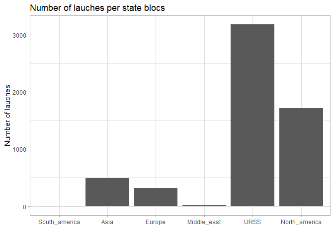<!-- -->

The same per country

```r
launches %>% 
  count(state_name, state_bloc) %>% 
  ggplot(aes(x = state_name, y = n)) +
  geom_bar(stat = "identity") +
  labs(title = "Number of lauches per state",
       x = "",
       y = "Number of lauches") +
  facet_wrap(~state_bloc, scales = "free")
```

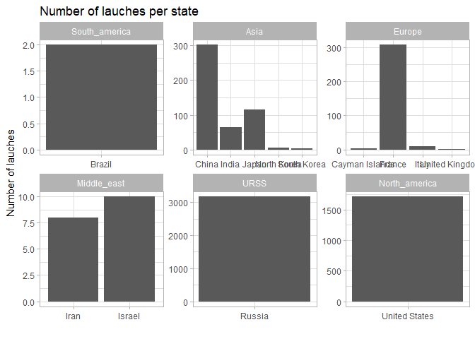<!-- -->


```r
launches %>% 
  count(launch_year, state_name, state_bloc) %>% 
  ggplot(aes(x = launch_year, y = n, colour = state_bloc)) +
  geom_line() +
  labs(title = "Number of lauches per state",
       x = "",
       y = "Number of lauches") +
  facet_wrap(~state_bloc, scales = "free") +
  facet_wrap(~state_name)
```

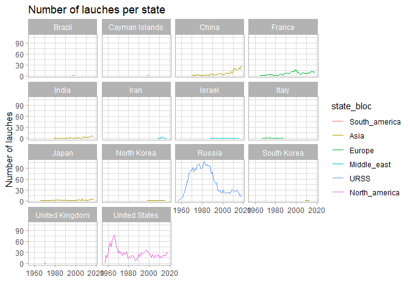<!-- -->


# Launches with time

The United states begin the space race, closely followed by Russia, which dominates the number of lauch until the late nineties. After that, Russia and the US are stable and equivalent. In the early 2000, China, followed by India increase their shares of the launches.


```r
launches %>% 
  count(state_name, launch_year) %>% 
  mutate(state_name = fct_reorder(state_name, -n, sum)) %>% 
  ggplot(aes(x = launch_year, y = n, colour = state_name)) +
  geom_line(size = 1.5) +
  labs(title = "Number of lauches per state",
       x = "Year of launch",
       y = "Number of lauches",
       colour = "State") 
```

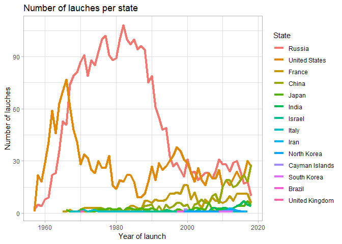<!-- -->

```r
launches %>% 
  count(state_name_short, launch_year) %>%
  mutate(state_name_short = fct_reorder(state_name_short, -n, sum)) %>% 
  ggplot(aes(x = launch_year, y = n, 
             colour = state_name_short)) +
  geom_line(size = 1.5) +
  labs(title = "Number of lauches per state (short list)",
       x = "Year of launch",
       y = "Number of lauches",
       colour = "State")
```

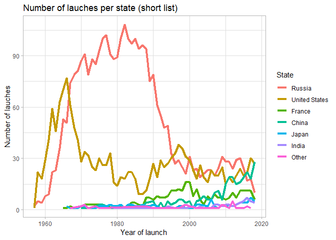<!-- -->

```r
launches %>% 
  count(state_bloc, launch_year) %>%
  mutate(state_bloc = fct_reorder(state_bloc, -n, sum)) %>% 
  ggplot(aes(x = launch_year, y = n, 
             colour = state_bloc)) +
  geom_line(size = 1.5) +
  labs(title = "Number of lauches per state bloc",
       subtitle = "US and USSR dominated the early race, Asia is booming now",
       x = "Year of launch",
       y = "Number of lauches",
       colour = "State bloc") +
  theme_minimal() +
  theme(panel.grid = element_blank())
```

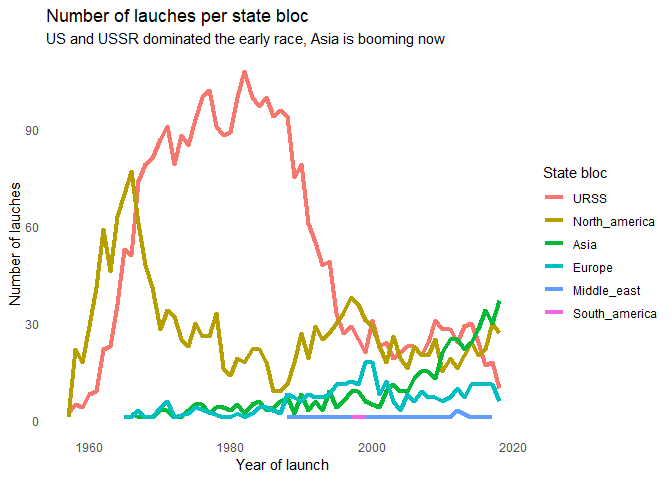<!-- -->


# Private vs public lauches

By bloc


```r
launches %>% 
  filter(state_bloc != "South_america" & state_bloc != "Middle_east") %>% 
  count(state_bloc, launch_year, agency_type) %>%
  ggplot(aes(x = launch_year, y = n, 
             colour = agency_type)) +
  geom_line(size = 1.5) +
  facet_wrap(~state_bloc, nrow = 4) +
  labs(title = "Number of lauches per state bloc",
       subtitle = "US and USSR dominated the early race, Asia is booming now",
       x = "Year of launch",
       y = "Number of lauches",
       colour = "State bloc") +
  scale_fill_brewer(palette = "Set1") +
   theme_minimal() +
   theme(panel.grid = element_blank(),
        strip.text = element_text(face = "bold"))
```

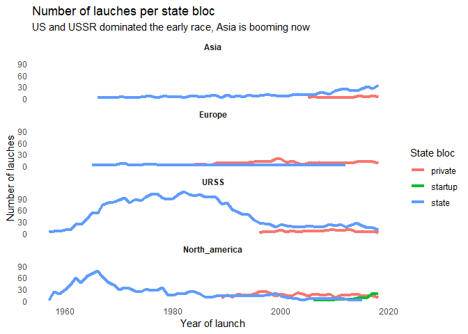<!-- -->

```r
launches %>% 
  filter(state_bloc != "South_america" & state_bloc != "Middle_east") %>% 
  count(state_bloc, launch_year, agency_type) %>%
  ggplot(aes(x = launch_year, y = n, 
             fill = agency_type)) +
   geom_bar(stat ="identity", alpha = 0.7) +
  facet_wrap(~state_bloc,  nrow = 4) +
  labs(title = "Number of lauches per state bloc",
       subtitle = "US and USSR dominated the early race, Asia is booming now",
       x = "Year of launch",
       y = "Number of lauches",
       colour = "State bloc") +
  scale_fill_brewer(palette = "Set1") +
   theme_minimal() +
   theme(panel.grid = element_blank(),
        strip.text = element_text(face = "bold"))
```

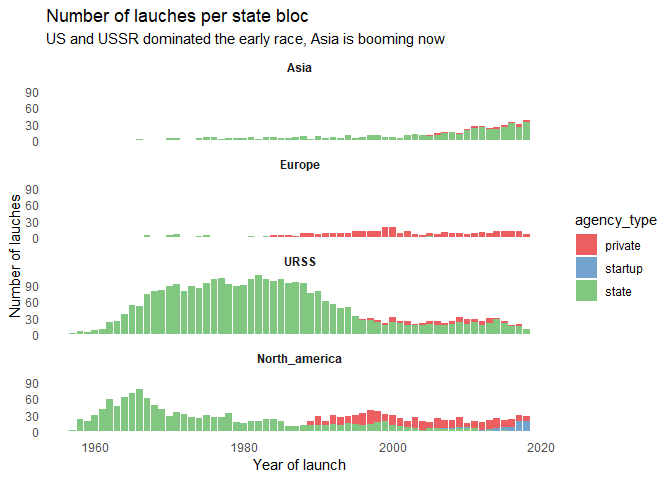<!-- -->


```r
launches %>% 
  filter(state_bloc != "South_america" & state_bloc != "Middle_east") %>% 
  select(state_bloc, launch_year, agency_type) %>% 
  group_by(state_bloc, launch_year) %>% 
  add_tally() %>% 
  add_count(agency_type) %>% 
  distinct(state_bloc, launch_year, agency_type, n, nn) %>%  
  mutate(proportion = nn / n) %>% 
  ggplot(aes(x = launch_year, y = proportion, 
             fill = agency_type)) +
  geom_bar(stat = "identity") +
  facet_wrap(~state_bloc, nrow = 4) +
  labs(title = "Number of lauches per state bloc",
       subtitle = "US and USSR dominated the early race, Asia is booming now",
       x = "Year of launch",
       y = "Number of lauches",
       Fill = "State bloc") +
  scale_fill_brewer(palette = "Set1") +
  theme_minimal() +
   theme(panel.grid = element_blank(),
        strip.text = element_text(face = "bold"))
```

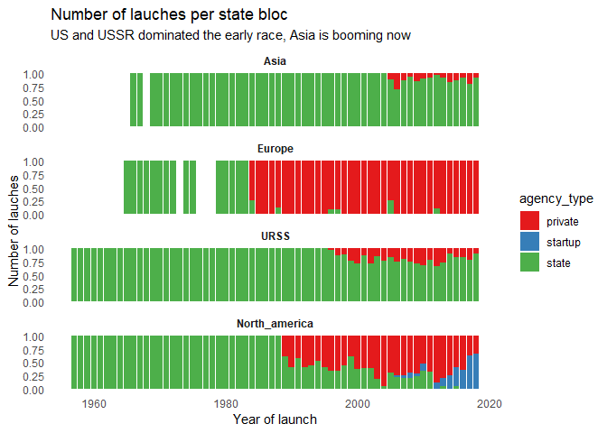<!-- -->


```r
launches %>% 
  filter(state_bloc != "South_america" & state_bloc != "Middle_east") %>% 
  #count(state_bloc, agency_type, launch_year) %>% 
  ggplot(aes(x = launch_year, fill = agency_type) ) +
  geom_histogram(bins = 62) + 
  facet_wrap(vars(state_bloc), nrow = 4) +
  theme_minimal() +
  theme(panel.grid = element_blank(),
        strip.text = element_text(face = "bold")) +
    scale_fill_brewer(palette = "Set1") +
  labs(title = "Who accounts for space launches in different blocs?",
       subtitle = "While in Europe and in the states the market has mostly been privatised, state accounts for most lauches in Asia and Russia",
       x = "Year of launch",
       y = "Number of launches")
```

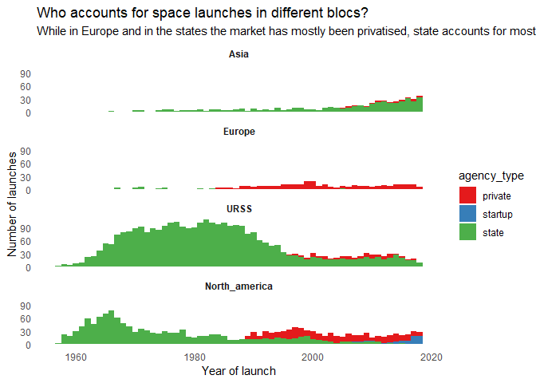<!-- -->


# US vs Russia


```r
launches %>% 
  filter(state_name %in% c("United States", "Russia")) %>%
   ggplot(aes(x = launch_year, fill = state_name)) +
  geom_area(stat = "bin", 
            position = "identity",
            bins = 30, alpha = 0.6) +
  scale_fill_manual(values = c("#999999", "#E69F00")) +
    theme_minimal() +
  theme(panel.grid = element_blank(),
        strip.text = element_text(face = "bold")) +
  labs(title = "Space race: US vs Russia",
       subtitle = "Numer of launches per year in Russia and the states",
       x = "Year of launches ",
       y = "Number of launches",
       fill = "")
```

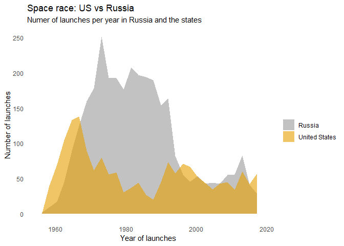<!-- -->

