I download the data from *https://data.cityofnewyork.us/api/views/43nn-pn8j/rows.csv*.

```r
# Get the raw data, clean them a bit

# You can use this url to download the data directly into R (will take a few seconds)
#df <- read_csv("https://data.cityofnewyork.us/api/views/43nn-pn8j/rows.csv")

df <- read_delim("../tidy_thuesday_37/DOHMH_New_York_City_Restaurant_Inspection_Results.csv",
                 delim = ";",
                 na = c("", "NA", "N/A"))
```

```
## Parsed with column specification:
## cols(
##   CAMIS = col_integer(),
##   DBA = col_character(),
##   BORO = col_character(),
##   BUILDING = col_character(),
##   STREET = col_character(),
##   ZIPCODE = col_integer(),
##   PHONE = col_character(),
##   `CUISINE DESCRIPTION` = col_character(),
##   `INSPECTION DATE` = col_character(),
##   ACTION = col_character(),
##   `VIOLATION CODE` = col_character(),
##   `VIOLATION DESCRIPTION` = col_character(),
##   `CRITICAL FLAG` = col_character(),
##   SCORE = col_integer(),
##   GRADE = col_character(),
##   `GRADE DATE` = col_character(),
##   `RECORD DATE` = col_character(),
##   `INSPECTION TYPE` = col_character()
## )
```

```r
# Some cleaning

df <- df %>% 
  # Clean names
  janitor::clean_names() %>%
  # Get rid of variables I won't use
  select(-phone, -grade_date, -record_date, -building, -street, zipcode) %>% 
  # Rename some variables
  rename(restaurant_id = camis,
         borough = boro) %>% 
  # Replace "Missing" by NA in borough
  mutate(borough = case_when(
    borough == "Missing" ~ NA_character_,
    TRUE ~ borough
  )) %>% 
  # Filter out the restaurants that have not been inspected yet
  filter(inspection_date != "01/01/1900") %>% 
  # Massages the inspection dates
  mutate(inspection_date = mdy(inspection_date),
         inspection_year = year(inspection_date),
         inspection_month = month(inspection_date),
         inspection_floored = floor_date(inspection_date, unit = "month"))  %>% 
  # Add a column saying wether the inspection was gradable
  mutate(gradable = case_when(
    inspection_type %in% c("Cycle Inspection / Initial Inspection", "Cycle Inspection / Re-Inspection", "Pre-Permit (Operational) / Initial Inspection", "Pre-Permit (Operational) / Re-Inspection") & 
      action %in% c("Violations were cited in the following area(s).","No violations were recorded at the time of this inspection.","Establishment Closed by DOHMH") & 
      inspection_date >="27/07/2010" ~ "yes",
  TRUE ~ "no")) %>% 
  mutate(presence_vermin = str_detect(violation_description, "mice|rats|roaches|flies"))


# Save csv clean version
write_csv(df, "../tidy_thuesday_37/nyc_restaurants.csv")
```


# Cuisine description

There are a lot of cuisine descriptions. Let's create a simplified version or two. I will try to aggreagte types of cooking per continent. Roughly...

By continent  


```r
unique(df$cuisine_description) %>%  head(10)
```

```
##  [1] "Irish"            "American"         "Chinese"         
##  [4] "Pizza"            "Bakery"           "Mexican"         
##  [7] "Pizza/Italian"    "Asian"            "Chinese/Japanese"
## [10] "Caribbean"
```

```r
df <- df %>% 
  mutate(cuisine_continent = case_when(
    cuisine_description %in% c("Irish", "Pizza", "Pizza/Italian", 
                               "Eastern European", "Spanish",  "French", 
                               "Italian", "Mediterranean", "Tapas", "Greek",
                               "Polish" , "Continental", "German",
                               "Pancakes/Waffles" , "Czech", "English",
                               "Portuguese", "Scandinavian",  
                               "Basque", "Russian") ~ "european",
    
    cuisine_description %in% c("American", "Donuts", "Hamburgers",
                               "Bagels/Pretzels" , "Steak", "Cajun",
                               "Californian", "Hotdogs/Pretzels", 
                               "Barbecue") ~ "north_american",
    
    cuisine_description %in% c("Chinese", "Asian", "Chinese/Japanese","Thai",
                               "Korean", "Indian", "Japanese",
                               "Vietnamese/Cambodian/Malaysia",
                               "Southwestern") ~ "eastern_asian",
   
     cuisine_description %in% c("Middle Eastern",  "Turkish",
                                "Pakistani", "Bangladeshi", "Delicatessen",
                                "Armenian" ,"Afghan", "Moroccan", "Egyptian",
                                "Iranian") ~ "middle_east",
    
    cuisine_description %in% c("Creole", "African", "Creole/Cajun", 
                               "Ethiopian") ~ "african",
    
    cuisine_description %in% c("Mexican", "Caribbean", 
                               "Latin (Cuban, Dominican, Puerto Rican, South & Central American)" , 
                               "Tex-Mex", "Brazilian", "Peruvian", "Chilean") ~ "latin_american",
    
    cuisine_description %in% c("Bakery", "Café/Coffee/Tea", "Soul Food",
                               "Jewish/Kosher" , "Chicken" , "Sandwiches", 
                               "Sandwiches/Salads/Mixed Buffet", "Ice Cream, Gelato, Yogurt, Ices",  "Juice, Smoothies, Fruit Salads" , "Salads",
                               "Australian", "Chinese/Cuban","Soups",
                               "Bottled beverages, including water, sodas, juices, etc.", 
                               "Vegetarian", "Soups & Sandwiches",  
                               "Not Listed/Not Applicable" , "Hotdogs",
                               "Fruits/Vegetables" ,"Nuts/Confectionary") ~ "other",
  
    cuisine_description %in% c("Polynesian", "Hawaiian",  "Seafood", "Indonesian", "Filipino") ~ "polynesian"
  ))
```


# Exploration grades


```r
df %>% 
  mutate(grade = fct_collapse(grade, N = "Not Yet Graded")) %>% 
  ggplot(aes(grade, fill = critical_flag)) +
  geom_bar(position = "fill") +
  facet_wrap(~ cuisine_continent) +
    labs(x = "Grade",
         y = "Percentage",
         title = "NYC Restaurant Inspections: 2010 to 2014",
         fill = "Status") +
  theme_light() +
  scale_fill_viridis(option = "viridis", discrete = TRUE)
```

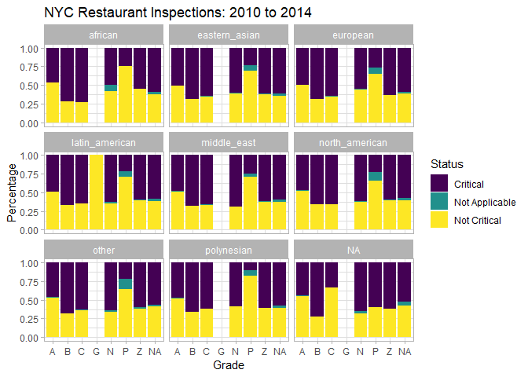<!-- -->

```r
df %>% 
  filter(grade %in% c("A", "B", "C")) %>% 
  ggplot(aes(grade, fill = critical_flag)) +
  geom_bar(position = "fill") +
    labs(x = "Grade",
         y = "Percentage",
         title = "NYC Restaurant Inspections: 2010 to 2014",
         fill = "Status") +
  theme_light() +
  scale_fill_viridis(option = "viridis", discrete = TRUE)
```

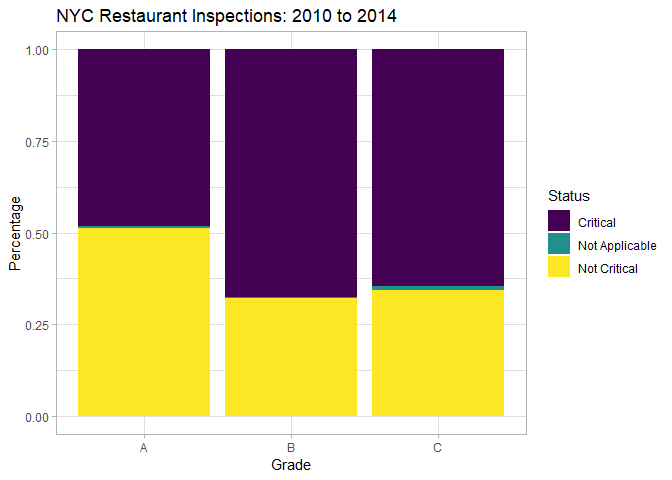<!-- -->


```r
df %>%
  select(score, grade) %>%
  drop_na(score, grade) %>%
  group_by(grade) %>%
  filter(grade %in% c("A", "B", "C")) %>% 
  summarize(count  = n(),
            min    = min(score),
            mean   = mean(score),
            median = median(score),
            max    = max(score))
```

```
## # A tibble: 3 x 6
##   grade  count   min  mean median   max
##   <chr>  <int> <dbl> <dbl>  <dbl> <dbl>
## 1 A     153357     0  9.93     11    42
## 2 B      24549    -1 20.6      20    32
## 3 C       7550    -1 35.8      35    98
```


# Number of inspection per restaurant

Some restaurants have been 

```r
df %>% 
  group_by(restaurant_id) %>% 
  count(restaurant_id, sort = TRUE) %>% 
  head(20)
```

```
## # A tibble: 20 x 2
## # Groups:   restaurant_id [20]
##    restaurant_id     n
##            <int> <int>
##  1      50001789    94
##  2      41683816    91
##  3      41630632    81
##  4      50033122    79
##  5      50035784    77
##  6      50012165    75
##  7      50036890    74
##  8      50045240    74
##  9      41046492    73
## 10      41403222    72
## 11      41642333    72
## 12      41297769    71
## 13      41497493    71
## 14      50042177    71
## 15      40700664    70
## 16      41510846    70
## 17      40762853    69
## 18      41474882    69
## 19      41669112    69
## 20      41687397    69
```

```r
df %>% 
  group_by(restaurant_id) %>% 
  count(restaurant_id, sort = TRUE) %>% 
  ggplot(aes(x = n)) +
  geom_histogram() +
  labs(x = "Number of inspections for each restaurant",
       title = "Number of inspections per restaurant") +
  theme_light() +
  scale_fill_viridis(option = "viridis", discrete = TRUE)
```

```
## `stat_bin()` using `bins = 30`. Pick better value with `binwidth`.
```

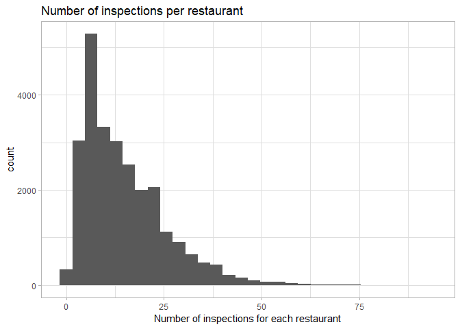<!-- -->

Does it depends on the borough?


```r
df %>% 
  group_by(restaurant_id, borough) %>% 
  drop_na(borough) %>% 
  count(restaurant_id, sort = TRUE) %>% 
  ggplot(aes(x = n)) +
  geom_histogram() +
  facet_wrap(~borough) +
  labs(x = "Number of inspections for each restaurant and borough",
       title = "Number of inspections per restaurant") +
  theme_light()
```

```
## `stat_bin()` using `bins = 30`. Pick better value with `binwidth`.
```

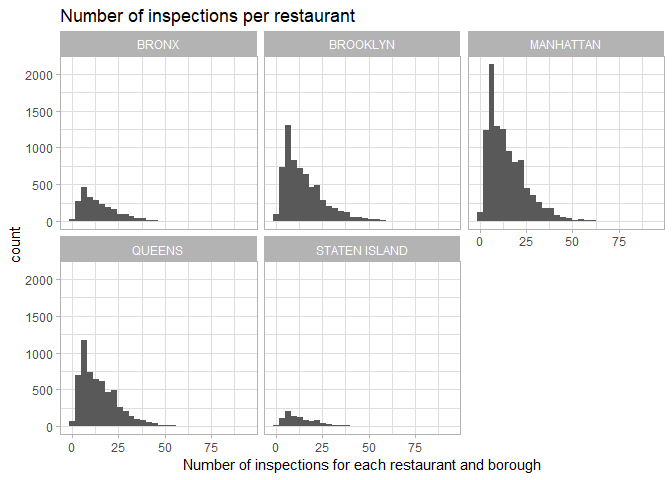<!-- -->

And per type of cooking ?


```r
df %>% 
  group_by(restaurant_id, cuisine_continent) %>% 
  drop_na(cuisine_continent) %>% 
  count(restaurant_id, sort = TRUE) %>% 
  ggplot(aes(x = n)) +
  geom_histogram() +
  facet_wrap(~cuisine_continent, scales = "free_y") +
  labs(x = "Number of inspections for each restaurant",
       title = "Number of inspections per restaurant") +
  theme_light()
```

```
## `stat_bin()` using `bins = 30`. Pick better value with `binwidth`.
```

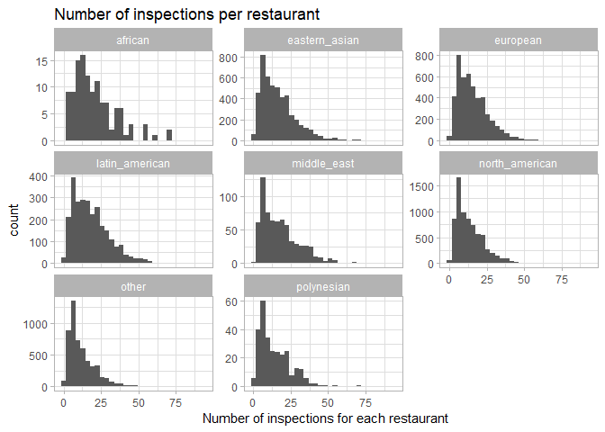<!-- -->

There are restaurants that were visited *a lot* for all types f cooking and borough.


# Most recent inspection

Let's have a look at the most recent inspection for each restaurant.


```r
# Select gradable ispection, and then select the last inspection
most_recent_inspection <- df %>% 
  filter(gradable == "yes") %>% 
  group_by(restaurant_id) %>% 
  slice(which.max(inspection_date)) %>% 
  ungroup()

# Check
most_recent_inspection %>% 
  group_by(restaurant_id) %>% 
  count(sort = TRUE) # ok
```

```
## # A tibble: 22,664 x 2
## # Groups:   restaurant_id [22,664]
##    restaurant_id     n
##            <int> <int>
##  1      30075445     1
##  2      30112340     1
##  3      30191841     1
##  4      40356018     1
##  5      40356151     1
##  6      40356483     1
##  7      40356731     1
##  8      40357217     1
##  9      40359480     1
## 10      40359705     1
## # ... with 22,654 more rows
```

On the most recent inspection, the grade is either A, not yet graded, Z or NA. This seem to be normal given how the grading system works.

The A grade have scores lower than 14. I am surprised by the fact that the NA grade have scores that would yield an A grade. Maybe I should go and read how the system works, it could be normal (like, pending grade attibution, or another visit).


```r
most_recent_inspection %>%
  drop_na(score) %>% 
  ggplot(aes(x = score)) +
  geom_histogram() +
  facet_wrap(~grade, scales = "free") +
  labs(title = "Scores distribution for each grade",
       subtitle = "Most recent inspection") +
  theme_light()
```

```
## `stat_bin()` using `bins = 30`. Pick better value with `binwidth`.
```

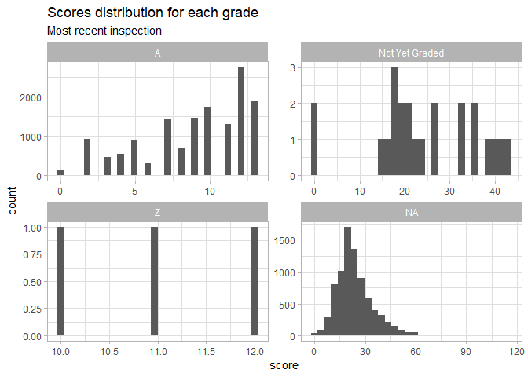<!-- -->

Let's have a look at the critical flag categories. It's a bit fuzzy what it means, they say that critial means "moe likely to contribute to foodborne illness".


```r
most_recent_inspection %>% 
  filter(critical_flag != "Not Applicable") %>% 
  ggplot(aes(x = score, fill = critical_flag)) +
  geom_histogram() +
  facet_wrap(~critical_flag) +
  labs(title = "Scores distribution for critical and not critical flags",
       subtitle = "Critical = more likely to contribute to foodborne illness",
       fill = "Critical flag",
       x = "Restaurant score") +
  theme_light() +
  scale_fill_manual(values = c("darkred", "darkgreen"))
```

```
## `stat_bin()` using `bins = 30`. Pick better value with `binwidth`.
```

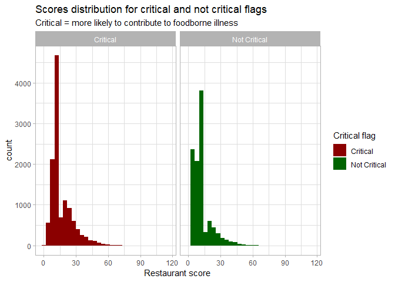<!-- -->

I am surprised that the distribution of scores look so alike in the two categories... It is true that one can get points (i.e. points linked to violation) with things not related to vermin, but I am a bit surprised.

# Per borough

Are there borough with restaurant with higher scores (or grades) ?

Distribution of score per borough.


```r
most_recent_inspection %>% 
  ggplot(aes(x = score)) +
  geom_histogram() +
  facet_wrap(~borough) +
  labs(title = "Scores distribution for each borough",
       subtitle = "Most recent inspection") +
  theme_light()
```

```
## `stat_bin()` using `bins = 30`. Pick better value with `binwidth`.
```

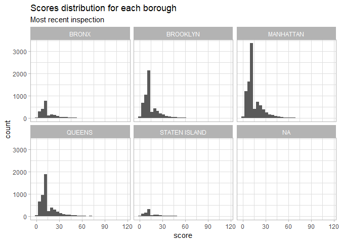<!-- -->

Seems the distribution is bimodal for all boroughs. So the mean is not going to be a decent summary. I will look at the proportion of grades in each borough instead.

Going back on the "all gradable inspections" (not only the recent ones), I get the proportion of each grade for each borough.

It seems that the distribution of grades in each borrogh is about the same (had to check the numbers to convince myself that it was not a mistake). About 80% of the inspection have a "A" grade.


```r
df %>% 
  select(borough, grade) %>% 
  drop_na(borough, grade) %>% 
  group_by(borough) %>% 
  add_tally() %>% 
  add_count(borough, grade) %>% 
  distinct(borough, grade, n, nn) %>%
  mutate(prop = nn / n) %>% 
  ggplot(aes(x = grade, y = prop, colour = grade)) +
  geom_point(size = 2) +
  facet_wrap(~borough) +
  labs(title = "Proportion of each grade in each borough") +
  theme_light() +
  scale_colour_viridis(option = "viridis", discrete = TRUE)
```

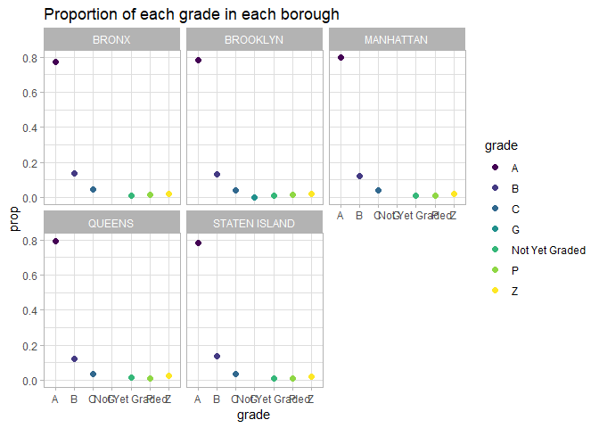<!-- -->

So much about the idea that some neighbourhoods have restaurants with more problems.


# Violation

I am interested in critical violations. There are about 100 types of violation.


```r
df$violation_description %>% unique() %>% head(20)
```

```
##  [1] "Live roaches present in facility's food and/or non-food areas."                                                                                                                                                                                                                                      
##  [2] "Raw, cooked or prepared food is adulterated, contaminated, cross-contaminated, or not discarded in accordance with HACCP plan."                                                                                                                                                                      
##  [3] "Plumbing not properly installed or maintained; anti-siphonage or backflow prevention device not provided where required; equipment or floor not properly drained; sewage disposal system in disrepair or not functioning properly."                                                                  
##  [4] "Non-food contact surface improperly constructed. Unacceptable material used. Non-food contact surface or equipment improperly maintained and/or not properly sealed, raised, spaced or movable to allow accessibility for cleaning on all sides, above and underneath the unit."                     
##  [5] "The original nutritional fact labels and/or ingredient label for a cooking oil, shortening or margarine or food item sold in bulk, or acceptable manufacturer\032s documentation not maintained on site."                                                                                            
##  [6] "Facility not vermin proof. Harborage or conditions conducive to attracting vermin to the premises and/or allowing vermin to exist."                                                                                                                                                                  
##  [7] "Choking first aid\032 poster not posted. \032Alcohol and pregnancy\032 warning sign not posted. Resuscitation equipment: exhaled air resuscitation masks (adult & pediatric), latex gloves, sign not posted. Inspection report sign not posted."                                                     
##  [8] "Pesticide use not in accordance with label or applicable laws. Prohibited chemical used/stored. Open bait station used."                                                                                                                                                                             
##  [9] "Thawing procedures improper."                                                                                                                                                                                                                                                                        
## [10] "Lighting inadequate; permanent lighting not provided in food preparation areas, ware washing areas, and storage rooms."                                                                                                                                                                              
## [11] "Cold food item held above 41º F (smoked fish and reduced oxygen packaged foods above 38 ºF) except during necessary preparation."                                                                                                                                                                    
## [12] "Food contact surface not properly washed, rinsed and sanitized after each use and following any activity when contamination may have occurred."                                                                                                                                                      
## [13] "Food not protected from potential source of contamination during storage, preparation, transportation, display or service."                                                                                                                                                                          
## [14] "Food worker does not use proper utensil to eliminate bare hand contact with food that will not receive adequate additional heat treatment."                                                                                                                                                          
## [15] "Proper sanitization not provided for utensil ware washing operation."                                                                                                                                                                                                                                
## [16] "Hand washing facility not provided in or near food preparation area and toilet room. Hot and cold running water at adequate pressure to enable cleanliness of employees not provided at facility. Soap and an acceptable hand-drying device not provided."                                           
## [17] "Filth flies or food/refuse/sewage-associated (FRSA) flies present in facility\032s food and/or non-food areas. Filth flies include house flies, little house flies, blow flies, bottle flies and flesh flies. Food/refuse/sewage-associated flies include fruit flies, drain flies and Phorid flies."
## [18] "Evidence of mice or live mice present in facility's food and/or non-food areas."                                                                                                                                                                                                                     
## [19] "Appropriately scaled metal stem-type thermometer or thermocouple not provided or used to evaluate temperatures of potentially hazardous foods during cooking, cooling, reheating and holding."                                                                                                       
## [20] "Food Protection Certificate not held by supervisor of food operations."
```


```r
df %>% 
  filter(critical_flag == "Critical") %>% 
  select(violation_description) %>% distinct()
```

```
## # A tibble: 49 x 1
##    violation_description                                                  
##    <chr>                                                                  
##  1 Live roaches present in facility's food and/or non-food areas.         
##  2 Raw, cooked or prepared food is adulterated, contaminated, cross-conta~
##  3 Cold food item held above 41º F (smoked fish and reduced oxygen packag~
##  4 Food contact surface not properly washed, rinsed and sanitized after e~
##  5 Food not protected from potential source of contamination during stora~
##  6 Food worker does not use proper utensil to eliminate bare hand contact~
##  7 Hand washing facility not provided in or near food preparation area an~
##  8 "Filth flies or food/refuse/sewage-associated (FRSA) flies present in ~
##  9 Evidence of mice or live mice present in facility's food and/or non-fo~
## 10 Appropriately scaled metal stem-type thermometer or thermocouple not p~
## # ... with 39 more rows
```

Let's have a look at restaurants with vermin problems

```r
df %>% 
  filter(presence_vermin == TRUE) %>% 
  ggplot(aes(x = score, fill = grade)) +
  facet_wrap(~grade, scales = "free") +
  geom_histogram() +
  scale_fill_viridis(option = "viridis", discrete = TRUE) +
  labs(title = "Distribution of scores in restaurants with vermin",
       subtitle = "Vermin = rats, mice, croaches or flies")
```

```
## `stat_bin()` using `bins = 30`. Pick better value with `binwidth`.
```

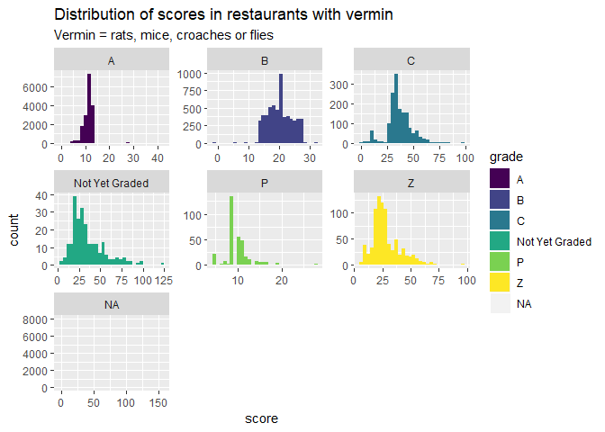<!-- -->


```r
df %>% 
  select(grade, presence_vermin, score) %>% 
  filter(presence_vermin == TRUE) %>% 
  add_tally() %>% 
  add_count(grade) %>% 
  mutate(prop = nn/n) %>% 
  distinct(grade, prop) %>% 
  ggplot(aes(x = "", y = prop, fill = grade)) +
    geom_bar(width = 1, stat = "identity") +
  labs(title = "Proportion of each grade in restaurants with vermin",
       y = "proportion",
       subtitle = "Restaurants with vermin related violations") +
  theme_light() +
  scale_fill_viridis(option = "viridis", discrete = TRUE)
```

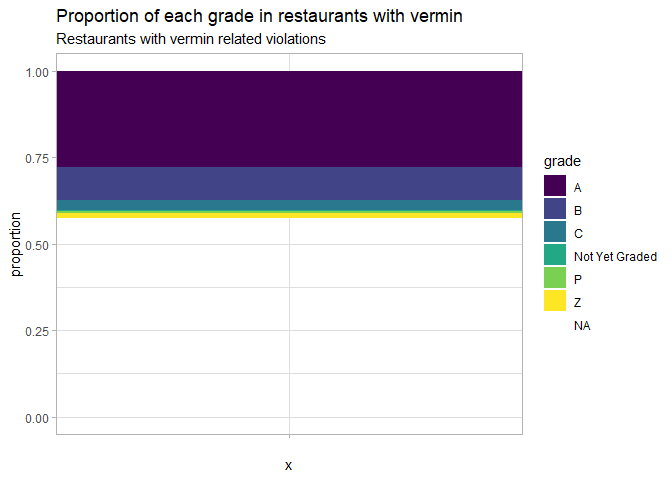<!-- -->

There is a quite decent proportion of restaurants that get an A despite the presence of mouse, flies, croaches or rats.

# Restaurant timelines

I attempt to get the restaurant timelines accross time.


```r
# df %>% 
#   filter(inspection_year > 2014) %>% 
#   filter(gradable == "yes") %>% 
#   ggplot(aes(x = inspection_date, y = score, group = restaurant_id)) +
#   geom_line(alpha = 0.3) +
#   facet_wrap(~borough)
```

Ok, it's very difficult to read And long to plot. Let's concentrate on 2017 and 2018. And gradable visits.


```r
df %>% 
  filter(inspection_year > 2016) %>% 
  filter(inspection_year < 2019) %>% 
  filter(gradable == "yes") %>% 
  ggplot(aes(x = inspection_date, y = score, group = restaurant_id)) +
  geom_line(alpha = 0.3) +
  facet_wrap(~borough)
```

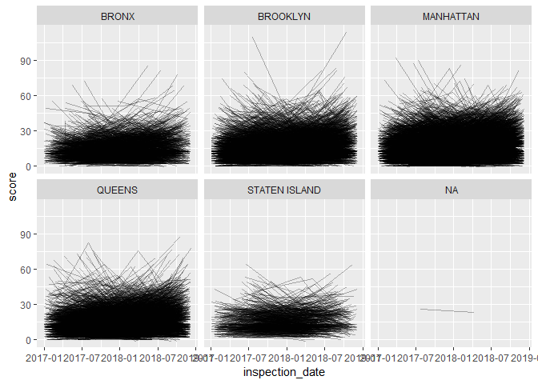<!-- -->


It's still horrible. Let's have a look at what it's happening in Manhattan.


```r
df %>% 
  filter(borough =="MANHATTAN") %>% 
  filter(inspection_year > 2016) %>% 
  filter(gradable == "yes") %>% 
  ggplot(aes(x = inspection_date, y = score, 
             group = restaurant_id)) +
  geom_line(alpha = 0.3)
```

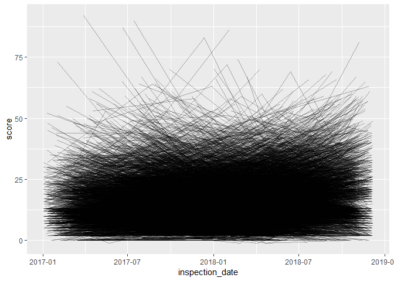<!-- -->


Ok, obviously I won't go far with all restaurants. Let's go for proportion of A, B and C at a given time.


```r
df %>% 
  drop_na(grade) %>% 
  filter(grade %in% c("A", "B", "C")) %>% 
  filter(inspection_year > 2014 & inspection_year < 2019) %>% 
  group_by(inspection_floored) %>% 
  add_tally() %>% 
  add_count(inspection_floored, grade) %>% 
  distinct(inspection_floored, grade, n, nn) %>%
  mutate(prop = nn / n) %>% 
  ggplot(aes(x = inspection_floored, y = prop, colour = grade)) +
  geom_line(size = 2) +
  labs(title = "Proportion of each restaurant grade accross time (2015 to 2018)",
       subtitle = "A is good, B and C are not!",
       x = "Time",
       colour = "Inspection grade") +
  theme_light() +
  scale_colour_viridis(option = "viridis", discrete = TRUE)
```

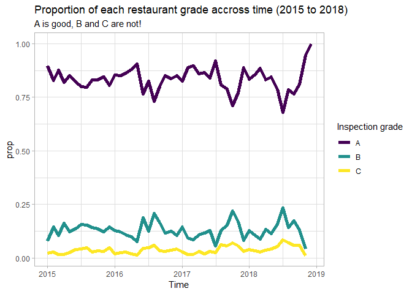<!-- -->

Ok, so I do not see the trend of the original 538 article. Like them, I removed the other grades. I allowed a longer time period, but I don't really see the same signla in the period they looked at. Maybe they kept the restaurants with no current grades in the lot?
