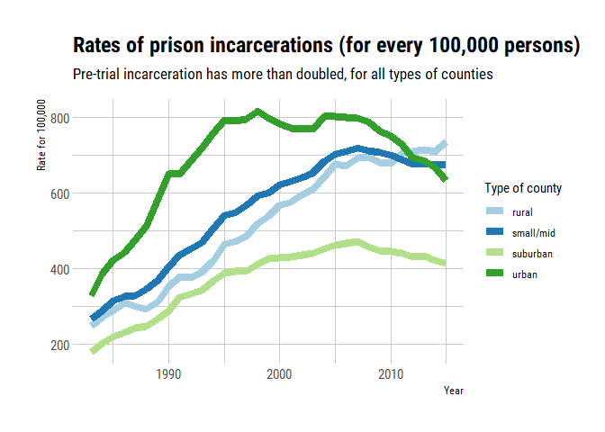
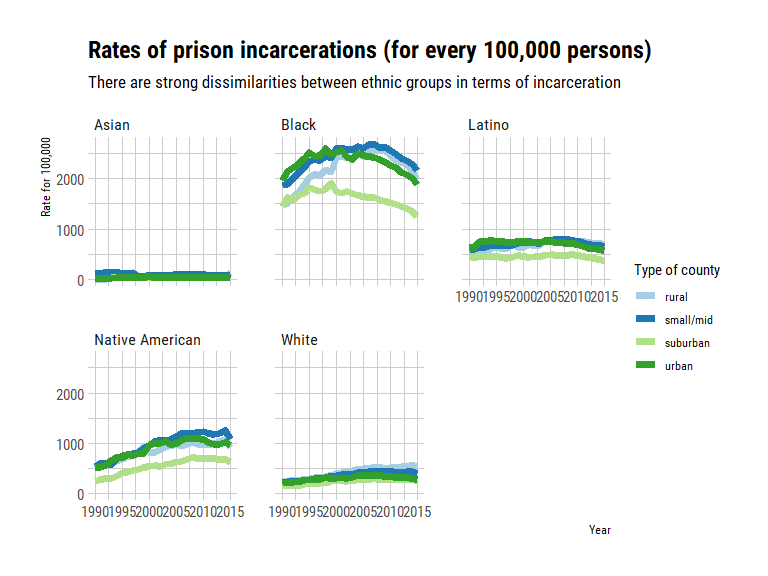

Here is my first take at exploring the [#Tidytuesday](https://github.com/rfordatascience/tidytuesday/tree/master/data/2019/2019-01-22) challenge from **week 4**. 

# Today's dataset & aims

This week's challenge is a large set of data concerning incarceration trends in the US. Data come from the [github](https://github.com/vera-institute/incarceration_trends) page of the [Vera Institute of Justice](http://trends.vera.org/incarceration-rates?data=localJail). Vera aggregated data from several US administration to obtain county-level jail data (1970-2015) and prison data (1983-2015).

The original data is apparently a bit messy, and Thomas Mock provided pre-tamed datasets, and very-tamed summary datasets, as well as the R code of his data wrangling^[did I ever mentioned how I love code reproducibility?], for people who wanted to focus more on visualization and analysing rather than fitting untidiness for today.

They are many questions that one can study, even with the (slightly) reduced datasets, and I think I will explore some of them in different posts.

In this first (short) post, I will focus on the prison incarceration summary, as it is already clean, because today, I don't have much time and I am in the mood for plotting things.


# Data structure


```r
glimpse(summary_prison)
```

```
## Observations: 1,000
## Variables: 4
## $ year            <int> 1983, 1983, 1983, 1983, 1983, 1983, 1983, 1983...
## $ urbanicity      <fct> rural, rural, rural, rural, rural, rural, smal...
## $ pop_category    <fct> Black, Female, Male, Other, Total, White, Blac...
## $ rate_per_100000 <dbl> 1116.87618, 22.79699, 573.79747, 315.49022, 24...
```

This table has only four columns:
- `year`  
- `urbanicity`: type of county  
- `pop_category`  
- `rate_per_100000`: incarceration rate in prison, for 100,000 people   

The column `pop_category` is a sort of *pot-pourri* as it mixes ethnicity data, gender data and "total". I will extract the type of data that I want depending on the graph. Sadly, this table will not allow me to cross ethnicity and gender (that will be for another day). 


Here is how Vera constructed the county classes of the `urbanicity` column:  
- **small/mid**: small to medium metropolitan areas.  
- **rural**: micropolitan (10,000 to 50,000 people) and areas not considered metropolitan or micropolitan.  
- **urban**: core county of a metropolitan area, more than a million people.  
- **suburban**: large metropolitan area, within metropolitan area.  


# Incarceration rate per county type and over time

We first see that the number of persons incarcerating in prison (after trial I suppose) has more than doubled between the eighties and 2015 in all types of counties. I do not know well enough the US justice system, but I suppose that this must reflect laws modification, or practice modifications that led to an increase in prison punishment. Or important increase in crime.

The urban areas rate grew extremely fast, faster than for the other types of counties, and peaked around 1995 to 2006 before reaching a level equivalent to the one of small and middle counties, and of rural areas. The suburban types of counties has always had lower rates of prison incarceration, and the gap between this type of counties and the rest has been growing since the year 2000.


```r
summary_prison %>% 
  filter(pop_category == "Total") %>% 
  ggplot(aes(x = year,
             y = rate_per_100000,
             colour = urbanicity)) +
  geom_line(size = 3) +
  labs(title = "Rates of prison incarcerations (for every 100,000 persons)",
       subtitle = "Pre-trial incarceration has more than doubled, for all types of counties", 
       x = "Year",
       y = "Rate for 100,000",
       colour = "Type of county") +
  theme_ipsum_rc() +
  scale_colour_brewer(palette = "Paired")
```

<!-- -->


# County type and ethnicity groups over time

We then make the same graph for each ethnic group. According to the [data dictionary]("https://github.com/rfordatascience/tidytuesday/tree/master/data/2019/2019-01-22"), the rate is given within a category for prison population per 100,000 people.

There are stark differences between groups. The Asian population seem to have very low incarceration rate (relative to their population size). The incarceration rates of the Latino population seem to be very stable over time. The rate has slowly but steadily increased for Native American people, while it peaked rapidly in the 2000's for Black people before getting back to their initial rates. White people incarcerations have increased very slowly all along.

So there are differences between the ethnic groups in terms of average rate of incarceration, but also in terms of the evolution of these rates. I have no idea why the trends are not similar for all populations: why is incarceration growing for Native Americans? Is it correlating with socio-economic growing distress? Why is there a brutal increase followed a decrease in the Black population? Are there historical factors? I don't know.

Something else is clear, in most cases, the suburban areas are where there are less incarcerations.


```r
summary_prison %>% 
  filter(pop_category %in% c("Asian", "Black", "Latino", "Native American", "White")) %>% 
  filter(year > 1989) %>% 
  ggplot(aes(x = year,
             y = rate_per_100000,
             colour = urbanicity)) +
  geom_line(size = 2.5) +
  labs(title = "Rates of prison incarcerations (for every 100,000 persons)",
       subtitle = "There are strong dissimilarities between ethnic groups in terms of incarceration", 
       x = "Year",
       y = "Rate for 100,000",
       colour = "Type of county") +
  facet_wrap(vars(pop_category)) +
  theme_ipsum_rc() +
  scale_colour_brewer(palette = "Paired")
```

<!-- -->


So far I am limited by the data, and also by how little I know about United States demography and social economics to go much further with these plots. I will have to dive into the other datasets to learn more.


