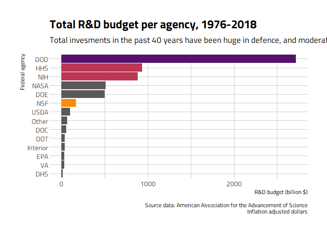

This week [Tidytuesday's data](https://github.com/rfordatascience/tidytuesday/tree/master/data/2019/2019-02-12) concern US research and development budget. There are three datasets, concerning the budget of 14 national agencies, with data for R&D, climate and energy.

I will focus on the research and development budget. I wish to know which agencies get the highest funding, and how research fundings evolved in the past 40 years. I kind of suspect that they decreased, and I would like to check it.

Also, I will learn from Otho Mantegazza, who did some nice clustering. Since I very rarelly used these tools, I thought it would be good to try to replicate his code.


First we import the data.


```r
# climate_spending <- read.csv("https://raw.githubusercontent.com/rfordatascience/tidytuesday/master/data/2019/2019-02-12/climate_spending.csv")


# energie_spending <- read.csv("https://raw.githubusercontent.com/rfordatascience/tidytuesday/master/data/2019/2019-02-12/energy_spending.csv")

read.csv("https://raw.githubusercontent.com/rfordatascience/tidytuesday/master/data/2019/2019-02-12/fed_r_d_spending.csv") %>% mutate(rd_budget_billion = rd_budget/(10^9)) -> feder_spendings
```

We have a first look at the structure of the data. The data.frame is pretty straightforward: 
- `department` the abbreviated name of the federal agencies
- `year`
- `rd_budget` the budget for research and developement
- `total_outlays` the money actually paid out by the U.S. Treasury
- `GDP` the Gross Domestic Product, which represent the US economy
- `discretionary_outlays` represent the part of the budget that pays for governmental programs. These spending levels are set each year by Congress. Yes, I had to go and look for the [meaning]("https://www.nationalpriorities.org/budget-basics/federal-budget-101/spending/")

I also created a column with the R&D budget in billions, because the numbers are easier to grasp then.


```r
glimpse(feder_spendings)
```

```
## Observations: 588
## Variables: 7
## $ department            <fct> DOD, NASA, DOE, HHS, NIH, NSF, USDA, Int...
## $ year                  <int> 1976, 1976, 1976, 1976, 1976, 1976, 1976...
## $ rd_budget             <dbl> 3.5696e+10, 1.2513e+10, 1.0882e+10, 9.22...
## $ total_outlays         <dbl> 3.718e+11, 3.718e+11, 3.718e+11, 3.718e+...
## $ discretionary_outlays <dbl> 1.756e+11, 1.756e+11, 1.756e+11, 1.756e+...
## $ gdp                   <dbl> 1.790e+12, 1.790e+12, 1.790e+12, 1.790e+...
## $ rd_budget_billion     <dbl> 35.696, 12.513, 10.882, 9.226, 8.025, 2....
```


## Total R&D budget

Since we are dealing with data through time, and with 14 categories, two types of visualization jumped to my mind: a heatmap and a line plot. Both of them are pretty easy to make with `ggplot2`.

From the heatmap, what is obvious is that some agencies receive far more budget than some others. **DOD** stands for the department of defense, and it seemed to be the singlest most funded agency. Anybody with even a varnish of history knowledge about the U.S. will expect that. **NASA** also have high founding, which is not totally surprising, especially given the data on Space Launches that we explored for #Tidytuesday week 3. The two remaining agencies that stand out, **HHS** and **DOE** concern human health.


```r
feder_spendings %>% 
  ggplot(aes(x = department, y = year, 
             fill = rd_budget_billion)) +
  coord_flip() +
  geom_tile() +
  labs(title = "R&D budget per agency and year",
       y = "Year",
       x = "Federal agency",
       fill = "Inlfation adjusted budget\n(billion $)",
       subtitle = "Department (DOD), health (NIH, HHS) and energy (DOE) \nhave the highest founding...",
       caption = "Source data: American Association for the Advancement of Science\nInflation adjusted dollars") +
  scale_fill_viridis_c(option = "inferno") +
  theme_ipsum_tw()
```

<!-- -->

Because of the huge variation of fundings between agencies, this representation limits us in seeing the finer patterns. So let's go back to good old line graphs. Since we already know which agencies are the most founded, I make a plot be agency, with free *y* scale.


```r
feder_spendings %>% 
  ggplot(aes( x = year, y = rd_budget_billion, 
              colour = department, 
              fill   = department)) +
  facet_wrap(~department, scales = "free_y", ncol = 3) +
  geom_line(size = 1) +
  geom_area(alpha = 0.5) +
  geom_point(size = 2) +
  
  labs(title = "R&D budget per agency and year",
       x = "Year",
       y = "Inflation-adjusted budget (billion $)",
       colour = "",
       caption = "Source data: American Association for the Advancement of Science") +
  scale_colour_viridis_d(option = "inferno") +
  scale_fill_viridis_d(option = "inferno") +
  theme_ipsum_tw() +
  theme(legend.position = "none",
        panel.grid.major = element_blank(),
        strip.text = element_text(face = "bold"))
```

<!-- -->

We can see that the budget of defense has steadily risen, with a bump in after year 2000. **NASA** budget was brutally reduced during the mid-eighties, but recovered and has been mostly stable since.The **NIH** and **NSF** budget have slowly increased over years, also **NIH** is now stagnating.

## Relative to total federal budget

Now, let's have a look at how much percent of the total federal budget is invested in these agencies. This informs us on the politic decisions on budget allocation between the different services.


```r
feder_spendings %>% 
  mutate(rd_rate = rd_budget / total_outlays) %>% 
  
  ggplot(aes(x = year, y = rd_rate, 
             colour = department, 
             fill   = department)) +
  facet_wrap(~department, scales = "free_y", ncol = 3) +
  
  geom_line(size = 1) +
  geom_area(alpha = 0.5) +
  geom_point(size = 2) +
  
  labs(title = "Percentage of total federal budget invested in R&D in the USA",
       y = "Year",
       subtitle = "...but massive decrease of R&D founding over years (relative to total budget)",
       x = "Percentage of US budget",
       caption = "Source data: American Association for the Advancement of Science") +
  
  scale_colour_viridis_d(option = "inferno") +
  scale_fill_viridis_d(option = "inferno") +
  scale_y_continuous(labels = scales::percent) +
  
  theme_ipsum_tw() +
  theme(legend.position = "none",
        panel.grid.major = element_blank(),
        strip.text = element_text(face = "bold"))
```

<!-- -->


## Relative to GDP

If we now investigate what the different budget represent compared to the GDP of the U.S.


```r
feder_spendings %>% 
  mutate(rd_rate = rd_budget / gdp) %>% 
  
  ggplot(aes( x = year, y = rd_rate, 
              colour = department, 
              fill   = department)) +
  facet_wrap(~department, scales = "free_y", ncol = 3) +
  
  geom_line(size = 1) +
  geom_area(alpha = 0.5) +
  geom_point(size = 2) +
  
  labs(title = "Percentage of GDP invested in R&D in the USA",
       x = "Year",
       subtitle = "Massive decrease of R&D founding over years (relative to GDP)",
       y = "R&D budget as percents of GPD",
       colour = "",
       caption = "Source data: American Association for the Advancement of Science") +
  scale_colour_viridis_d(option = "inferno") +
  scale_fill_viridis_d(option = "inferno") +
  theme_ipsum_tw() +
  theme(legend.position = "none",
        panel.grid.major = element_blank(),
        strip.text = element_text(face = "bold"))
```

<!-- -->

In recent year, the budget invested in research and development, compared to the GDP has been decreasing for pretty much all agencies.

# Cumulative budget over years

If we add the total amount of money invested in R&D fr each agencies over the forty years:


```r
feder_spendings %>% 
  group_by(department) %>% 
  summarise(total_founded = sum(rd_budget, na.rm = TRUE),
            total_budget  = sum(total_outlays, na.rm = TRUE)) %>% 
  mutate(total_founded_billions = total_founded / (10^9),
         rd_rate = total_founded/total_budget,
         department = fct_reorder(department, rd_rate)) -> feder_total
```

Here again, we can see that the U.S. invested a *huge* amount of money in R&D for defence (over 2500 billion $) over the years. I cannot even understand what that sum of money means.
They invested a bit less than 2000 billion $ in health.


```r
ggplot(data = feder_total,
       aes(x = department, y = total_founded_billions)) +
  coord_flip() +
  geom_col() +
  geom_col(data = filter(feder_total, 
                         department == "DOD"),
           fill =  "#56106EFF") +
  geom_col(data = filter(feder_total, 
                         department == "NIH" | department == "HHS"),
           fill = "#BB3754FF") +
  geom_col(data = filter(feder_total, 
                         department == "NSF"),
           fill = "#F98C0AFF") +
  
  labs(title = "Total R&D budget per agency, 1976-2018",
       y = "R&D budget (billion $)",
       x = "Federal agency",
       subtitle = "Total invesments in the past 40 years have been huge in defence, and moderate in health",
       caption = "Source data: American Association for the Advancement of Science\nInflation adjusted dollars") +
  theme_ipsum_tw()
```

<!-- -->


# A litte focus on NSF

As a biologist, the **NSF** would be the main funding agency if I were working in the U.S., so let's single it out.


```r
feder_spendings %>% 
  filter(department == "NSF") %>% 
  ggplot(aes(x = year, y = rd_budget_billion,
             colour = department,
             fill = department)) +
  geom_line(size = 1) +
  geom_area(alpha = 0.5) +
  geom_point(size = 2) +
  
  labs(title = "National Science Fundation budget 1976-2017",
       subtitle = "The total budget of the NSF increases with time...",
       x = "",
       y = "Inflation-adjusted budget (billion $)",
       colour = "",
       caption = "Source data: American Association for the Advancement of Science") +
  scale_colour_viridis_d(option = "inferno") +
  scale_fill_viridis_d(option = "inferno") +
  theme_ipsum_tw() +
  theme(legend.position = "none",
        panel.grid.major = element_blank())
```

<!-- -->


```r
feder_spendings %>% 
  filter(department == "NSF") %>% 
  mutate(rd_rate = rd_budget / gdp) %>% 
  ggplot(aes(x = year, y = rd_rate,
             colour = department,
             fill = department)) +
  geom_line(size = 1) +
  geom_area(alpha = 0.5) +
  geom_point(size = 2) +
  
  labs(title = "NSF fundings relative to GPD, 1976-2017",
       subtitle = "... but fundings relative to GPD crash",
       x = "Year",
       y = "NSF budget as percents of GPD",
       colour = "",
       caption = "Source data: American Association for the Advancement of Science") +
  scale_colour_viridis_d(option = "inferno") +
  scale_fill_viridis_d(option = "inferno") +
  scale_y_continuous(labels = scales::percent) +
  theme_ipsum_tw() +
  theme(legend.position = "none",
        panel.grid.major = element_blank())
```

<!-- -->


# From Otho

https://otho.netlify.com/post/government-funding/

Otho looked at correlations, and then clustered agencies by similarity of founding patterns


## Correlations


```r
rd_wide <- 
  feder_spendings %>% 
  select(department, year, rd_budget) %>% 
  tidyr::spread(key = department,
                value = rd_budget)
```


```r
# correlation of everything against everything
rd_wide %>%
  column_to_rownames("year") %>%
  # Test correlation
  cor() %>% 
  # visualize
  as_tibble(rownames = "agency") %>% 
  gather(DHS:VA, key = "agency_2", value = "corr") %>% 
  ggplot(aes(x = agency,
             y = agency_2,
             fill = corr)) +
  geom_tile() + 
  scale_fill_viridis_c() +
  theme(aspect.ratio = 1,
        axis.text.x = element_text(angle = 90, hjust = .5))
```

<!-- -->

## Clustering

>> With clusters, we want to capture the behaviour of our variables. Meaning that we want to capture how one variable behaves compared to another: when one variable increases in value, does the other do the same?  

>> So, to make variables comparable, we must scale them.

>> Probably, the most common scaling is by z-scores. But, because z-scores are centered at 0. This introduces negative numbers, but spendings for R&D agencies are (hopefully ;) ) never negative.

>> Thus, I decided to rescale spendings for each agency between 0 and 1, in this way we can make them comparable and present them in a more intuitive way. Moreover, this kind of scaling preserves 0 as anchored point.


```r
# scale each variable between 0 and 1
rd_wide_01 <- 
  rd_wide %>%
  mutate_at(vars(-contains("year")),
            ~scales::rescale(., to = c(0,1),
                             from = c(0, max(.))))


# this is how it looks after scaling
rd_wide_01 %>% print()
```

```
##    year       DHS       DOC       DOD       DOE       DOT       EPA
## 1  1976 0.0000000 0.4490132 0.3784363 0.6947583 0.9352989 0.8238298
## 2  1977 0.0000000 0.4588816 0.4025126 0.8772904 0.8968059 0.8221277
## 3  1978 0.0000000 0.4775219 0.3924940 1.0000000 0.9467649 1.0000000
## 4  1979 0.0000000 0.5219298 0.3941055 0.9967439 0.8222768 0.9378723
## 5  1980 0.0000000 0.5180921 0.3923138 0.9720999 0.8583129 0.7685106
## 6  1981 0.0000000 0.4544956 0.4424808 0.9447743 0.8009828 0.7668085
## 7  1982 0.0000000 0.3799342 0.4971429 0.7763519 0.5749386 0.5455319
## 8  1983 0.0000000 0.3837719 0.5407686 0.7105280 0.6552007 0.4263830
## 9  1984 0.0000000 0.4139254 0.6163689 0.7489625 0.8337428 0.4408511
## 10 1985 0.0000000 0.4325658 0.6829155 0.7688821 0.7248157 0.5234043
## 11 1986 0.0000000 0.4265351 0.7307819 0.6966098 0.6109746 0.5421277
## 12 1987 0.0000000 0.4407895 0.7584522 0.6669220 0.4873055 0.5651064
## 13 1988 0.0000000 0.4188596 0.7542539 0.6935453 0.4807535 0.5940426
## 14 1989 0.0000000 0.4199561 0.7339624 0.7166571 0.4799345 0.6068085
## 15 1990 0.0000000 0.4298246 0.6953512 0.7727128 0.5020475 0.6255319
## 16 1991 0.0000000 0.4923246 0.6598251 0.7836941 0.5634726 0.6536170
## 17 1992 0.0000000 0.5219298 0.6539306 0.8478580 0.8304668 0.6842553
## 18 1993 0.0000000 0.6935307 0.6568354 0.7579646 0.8108108 0.6740426
## 19 1994 0.0000000 0.8744518 0.5875749 0.6747111 0.8190008 0.7812766
## 20 1995 0.0000000 0.9369518 0.5727644 0.6260614 0.8337428 0.7208511
## 21 1996 0.0000000 0.8157895 0.5691810 0.6009066 0.7387387 0.6161702
## 22 1997 0.0000000 0.7790570 0.5820620 0.5852646 0.7387387 0.7463830
## 23 1998 0.0000000 0.8711623 0.5800795 0.5905637 0.7035217 0.7897872
## 24 1999 0.0000000 0.8547149 0.5929181 0.6396603 0.7149877 0.8187234
## 25 2000 0.0000000 0.9067982 0.5968407 0.6256784 0.7002457 0.6689362
## 26 2001 0.0000000 0.7768640 0.6234508 0.6793079 0.8099918 0.6714894
## 27 2002 0.2274163 0.9106360 0.7159714 0.6983337 0.8624079 0.6817021
## 28 2003 0.6184460 0.8722588 0.8352187 0.7171040 0.7608518 0.6408511
## 29 2004 0.8420720 0.7960526 0.9064723 0.7211901 0.7059787 0.7302128
## 30 2005 0.9848389 0.7730263 0.9364538 0.6917576 0.7272727 0.6859574
## 31 2006 1.0000000 0.7088816 0.9588444 0.6672413 0.8149058 0.6442553
## 32 2007 0.7460518 0.6968202 0.9927909 0.6837132 0.7444717 0.5617021
## 33 2008 0.7296273 0.7560307 0.9991731 0.7241908 0.8321048 0.5412766
## 34 2009 0.7946936 0.8739035 0.9915399 0.7548362 0.8697789 0.5497872
## 35 2010 0.6373973 0.8338816 1.0000000 0.7871417 1.0000000 0.5778723
## 36 2011 0.5356917 0.7439693 0.9352770 0.7598800 0.8714169 0.5523404
## 37 2012 0.3329122 0.7527412 0.8644898 0.7558578 0.8247338 0.5293617
## 38 2013 0.4655717 0.7658991 0.7482958 0.7360020 0.7215397 0.4851064
## 39 2014 0.6898294 0.8996711 0.7457302 0.8099342 0.6904177 0.4842553
## 40 2015 0.6064435 0.8750000 0.7370474 0.9597778 0.7583948 0.4629787
## 41 2016 0.3802906 0.9484649 0.7973814 0.9898487 0.7452907 0.4510638
## 42 2017 0.4643083 1.0000000 0.5498224 0.9597140 0.7665848 0.4306383
##          HHS  Interior      NASA       NIH       NSF     Other      USDA
## 1  0.2495064 0.9795918 0.8523842 0.2271634 0.3789137 0.4825770 0.5902956
## 2  0.2571058 0.9200680 0.8551090 0.2325134 0.3825879 0.5186386 0.5771208
## 3  0.2848527 0.9566327 0.8525886 0.2491579 0.3907348 0.5012156 0.6304627
## 4  0.2738729 1.0000000 0.8909401 0.2616412 0.3840256 0.9404376 0.6600257
## 5  0.2716554 0.9200680 0.9425749 0.2573952 0.3845048 1.0000000 0.6063625
## 6  0.2608108 0.8418367 0.9043597 0.2428737 0.3674121 0.7799838 0.6311054
## 7  0.2396084 0.7363946 0.7031335 0.2353441 0.3500000 0.6588331 0.5999357
## 8  0.2546989 0.7100340 0.4014305 0.2472047 0.3645367 0.5903566 0.6127892
## 9  0.2743597 0.6437075 0.4244550 0.2723130 0.4148562 0.5745543 0.6529563
## 10 0.2997269 0.6658163 0.4886921 0.3002236 0.4567093 0.4521880 0.6484576
## 11 0.3010790 0.6420068 0.5002044 0.3017239 0.4404153 0.5372771 0.6073265
## 12 0.3474322 0.6683673 0.5685286 0.3491664 0.4699681 0.5972447 0.6760925
## 13 0.3642805 0.6751701 0.5957766 0.3654146 0.4731629 0.5709076 0.6699871
## 14 0.3864835 0.7321429 0.7236376 0.3835593 0.5051118 0.5952188 0.6568123
## 15 0.3996809 0.7814626 0.8390327 0.3974863 0.4782748 0.7106969 0.6809126
## 16 0.4327285 0.8818027 0.9256812 0.4250573 0.5059105 0.6600486 0.7477506
## 17 0.4494956 0.8928571 0.9502725 0.4448156 0.5142173 0.8099676 0.7969152
## 18 0.4516862 0.8801020 0.9576294 0.4465140 0.5129393 0.6819287 0.7516067
## 19 0.4779728 0.9387755 1.0000000 0.4627339 0.5591054 0.6693679 0.7663882
## 20 0.4760256 0.8681973 0.9848093 0.4655929 0.5849840 0.6531605 0.7303985
## 21 0.4882495 0.7287415 0.9640327 0.4852096 0.5731629 0.5449757 0.7172237
## 22 0.5148335 0.7414966 0.9392371 0.5098933 0.5709265 0.5275527 0.7374679
## 23 0.5452038 0.6632653 0.9673706 0.5404648 0.5817891 0.5474068 0.7307198
## 24 0.6154907 0.6105442 0.9519755 0.6104679 0.6134185 0.5579417 0.7602828
## 25 0.6927550 0.7406463 0.9111717 0.6873213 0.6595847 0.4955429 0.8039846
## 26 0.7830814 0.7270408 0.9267030 0.7714496 0.7298722 0.5380875 0.9643316
## 27 0.8794115 0.7176871 0.9430518 0.8705806 0.7626198 0.5623987 0.9190231
## 28 0.9951321 0.7270408 0.9666894 0.9928100 0.8333866 0.5729335 1.0000000
## 29 1.0000000 0.6913265 0.9541553 1.0000000 0.8539936 0.5372771 0.9257712
## 30 0.9916705 0.6641156 0.9091962 0.9918476 0.8238019 0.5283630 0.9768638
## 31 0.9539984 0.6624150 0.9366485 0.9562091 0.8134185 0.5368720 0.9537275
## 32 0.9494551 0.6522109 0.9350817 0.9511705 0.8405751 0.5344408 0.8663239
## 33 0.9185169 0.6751701 0.8845368 0.9378096 0.8359425 0.5016207 0.8701799
## 34 0.9640858 0.6845238 0.6871253 0.9666827 0.8741214 0.5360616 0.8987789
## 35 0.9772020 0.7508503 0.7178474 0.9722875 0.9800319 0.5214749 0.9546915
## 36 0.9403954 0.7176871 0.6912125 0.9416310 0.9787540 0.4574554 0.8473650
## 37 0.9292263 0.7636054 0.8440736 0.9303083 0.9980831 0.5867099 0.8203728
## 38 0.8679720 0.7193878 0.8068801 0.8639851 0.9167732 0.7479741 0.7323265
## 39 0.8772480 0.7559524 0.8468665 0.8757607 0.9800319 0.6876013 0.8088046
## 40 0.8528815 0.7678571 0.8124659 0.8505109 1.0000000 0.6312804 0.8242288
## 41 0.8957190 0.8545918 0.9341281 0.8966230 0.9939297 0.6697731 0.8820694
## 42 0.9399897 0.8120748 0.8420300 0.9356017 0.9648562 0.6292545 0.8435090
##           VA
## 1  0.2955377
## 2  0.2735918
## 3  0.2604243
## 4  0.2582297
## 5  0.2626189
## 6  0.2794440
## 7  0.2289685
## 8  0.2538405
## 9  0.2999268
## 10 0.3152890
## 11 0.2670080
## 12 0.3145574
## 13 0.2692026
## 14 0.2860278
## 15 0.2765179
## 16 0.2743233
## 17 0.2977323
## 18 0.2948061
## 19 0.3160205
## 20 0.2940746
## 21 0.2889539
## 22 0.6342356
## 23 0.6254572
## 24 0.6773958
## 25 0.6649598
## 26 0.7234821
## 27 0.7490856
## 28 0.7937089
## 29 0.8215069
## 30 0.6825165
## 31 0.6854426
## 32 0.7103146
## 33 0.7527432
## 34 0.7915143
## 35 0.8602780
## 36 0.9465984
## 37 0.9290417
## 38 0.9166057
## 39 0.8522312
## 40 0.9005121
## 41 0.9231895
## 42 1.0000000
```

>> After scaling, I tried hierachical clustering. But, clustering functions such as hclust() or kmeans(), by default, cluster the rows of a dataset: we must to modify the format of the data again.

>> This time we transpose the data with t(), to exchange rows and columns.


```r
# For clustering
# we need to transpose the data
# because dist() %>% clusters the columns
rd_for_clust <-   
  rd_wide_01 %>%
  column_to_rownames("year") %>%
  t() 

rd_hclust <-
  rd_for_clust %>% 
  dist() %>%
  hclust() 
```

Let's visualize the results


```r
rd_hclust %>% plot()
```

<!-- -->


```r
rd_for_clust %>% 
  superheat::superheat(row.dendrogram = TRUE,
                       left.label.text.size = 3,
                       bottom.label.text.angle = 90,
                       bottom.label.text.size = 3,
                       grid.hline.col = "grey40",
                       grid.vline.col = "grey40")
```

<!-- -->

